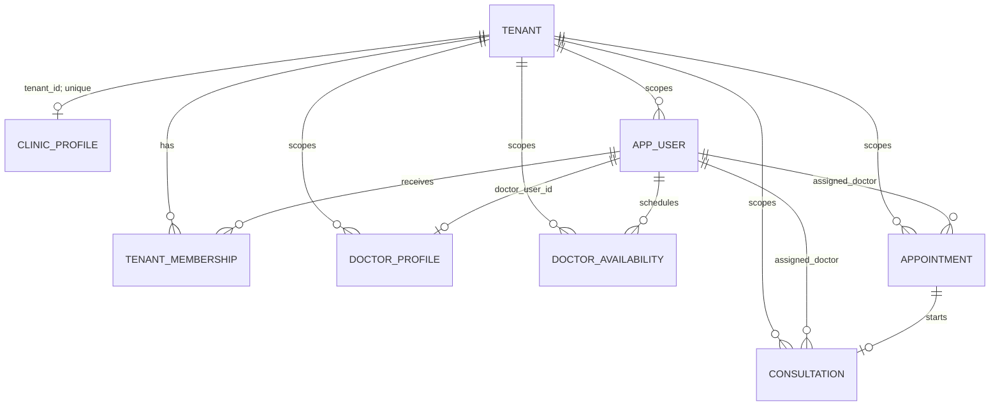
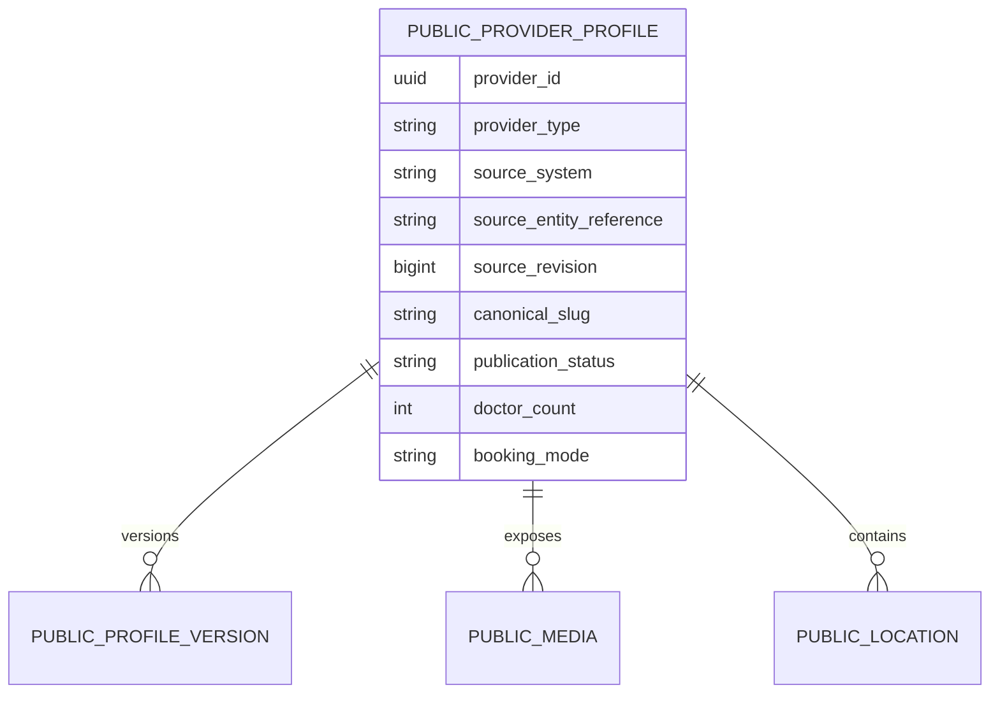
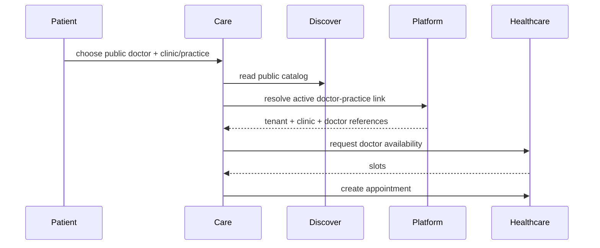

# Jeevanam Healthcare Tenant, Clinic, and Doctor Architecture Review

**Status:** Analysis only  
**Review date:** 2026-08-07  
**Scope:** Existing Healthcare hierarchy and its representation in persistence, services, authorization, appointments, availability, Discover synchronization, Platform connections, and Care booking.

No source code, configuration, schema, migration, fixture, or database data was changed. The two live examples were inspected read-only.

## 1. Executive Summary

The current Healthcare implementation is **tenant-scoped rather than explicitly clinic-scoped**:

```text
Tenant
  +-- one ClinicProfile (database-enforced by unique tenant_id)
  +-- many tenant users/memberships
  +-- many DoctorProfiles, each keyed by tenant_id + doctor_user_id
  +-- availability, appointments, and consultations keyed by tenant_id + doctor_user_id
```

This behaves like `Tenant -> Clinic -> Doctor` only because `clinic_profiles.tenant_id` is unique. The Doctor-to-Clinic relationship is not persisted. The code selects the one clinic by tenant and treats every tenant-scoped doctor as belonging to it. No appointment, availability, or consultation record contains `clinic_id`.

The authoritative current model is therefore:

> A Tenant is the SaaS and isolation boundary. A tenant has at most one operational ClinicProfile. Doctors are tenant users with the `DOCTOR` membership role and an operational DoctorProfile. The clinic relationship is an implicit tenant-scope convention, not an explicit domain association.

Discover synchronization follows the same convention. `HealthcarePublicListingSyncService.syncTenant` loads the clinic by tenant and all active doctor profiles by tenant. It projects clinic and doctor profiles independently into Discover. It does not project a clinic-doctor relationship. Discover's public clinic detail mapper also returns an empty doctors list, while its doctor responses synthesize a clinic slug from the first location label. This explains the observed Care behavior.

Platform's doctor-practice link schema is more expressive than Healthcare persistence: it has public doctor/practice references, tenant reference, platform clinic reference, tenant doctor user reference, and tenant doctor profile reference. The bridge anticipates `Tenant -> Clinic -> Doctor`, but current Amit data has no active doctor-practice link and Green Valley has no doctor profile to link.

The immediate architectural issue is not that `tenant_id` is wrong. It is that the current one-clinic assumption is undocumented and encoded indirectly across multiple bounded contexts. It must be treated as a deliberate v1 invariant until a future multi-clinic model is specified. Discover/Care work must not infer clinic membership from a slug or from `doctor_count`.

## 2. Documentation Findings

### Intended model stated by documentation

- [`ARCHITECTURE_CONSTITUTION.md`](/home/iadmin/code/clinic-management-platform/docs/architecture/ARCHITECTURE_CONSTITUTION.md) defines tenant isolation and bounded-context ownership.
- [`MODULE_BOUNDARIES.md`](/home/iadmin/code/clinic-management-platform/docs/architecture/MODULE_BOUNDARIES.md) assigns tenant persistence to `identity-domain`, clinic persistence to `clinic-domain`, appointment and availability persistence to `appointment-domain`, and consultation persistence to `consultation-domain`.
- [`JEEVANAM_DISCOVER_CARE_SEGREGATION.md`](/home/iadmin/code/clinic-management-platform/docs/architecture/JEEVANAM_DISCOVER_CARE_SEGREGATION.md) separates public discovery from Healthcare operations, but describes the public/operational relationship at a capability level rather than defining the Healthcare cardinality.
- [`discover-healthcare-public-listing-sync.md`](/home/iadmin/code/clinic-management-platform/docs/specs/discover-healthcare-public-listing-sync.md) says operational clinic and doctor records are Healthcare-owned and Discover owns their public projection. It requires an eligible parent clinic for a doctor but does not define a persisted doctor-clinic edge.
- [`provider-public-platform-connection-architecture.md`](/home/iadmin/code/clinic-management-platform/docs/specs/provider-public-platform-connection-architecture.md) explicitly models public clinic links and public doctor-practice links. Its doctor-practice link fields anticipate operational doctor, tenant, and clinic references.
- [`web-care/README.md`](/home/iadmin/code/clinic-management-platform/web-care/README.md) assigns patient booking completion and portal workflows to Care, while public provider discovery and Healthcare operations remain separate concerns.

### Documentation gaps and contradictions

1. The architecture documents establish tenant isolation but do not state whether a tenant has one clinic or many.
2. They do not distinguish `tenant_id` as an isolation key from Clinic as an operational business parent.
3. The synchronization specification says “parent clinic” but current persistence has no doctor-to-clinic relationship; this is an implicit tenant lookup.
4. Platform documentation is more future-ready than Healthcare persistence because it carries both clinic and doctor references.
5. The documentation does not state that appointments, availability, consultations, and authorization are all tenant-plus-doctor scoped and clinic-blind.

## 3. Healthcare Domain Hierarchy

### Tenant

`TenantEntity` represents the SaaS customer/control-plane boundary. It owns tenant status, code, plan/modules, public-listing enablement, and lifecycle. It is used for server-side isolation and request context. It is not itself proof of an operational clinic relationship.

Evidence: [`TenantEntity.java`](/home/iadmin/code/clinic-management-platform/backend/domains/identity-domain/src/main/java/com/deepthoughtnet/clinic/identity/db/TenantEntity.java).

### Clinic

`ClinicProfileEntity` is the operational clinic/facility profile: name, contact, address, registration, logo, active state, public-listing flag, and slug. It belongs to a tenant through `tenant_id`. The entity and original migration both enforce one clinic profile per tenant.

Evidence: [`ClinicProfileEntity.java`](/home/iadmin/code/clinic-management-platform/backend/domains/clinic-domain/src/main/java/com/deepthoughtnet/clinic/clinic/db/ClinicProfileEntity.java#L12) and [`V002__create_clinic_profiles.sql`](/home/iadmin/code/clinic-management-platform/backend/api/api-bff/src/main/resources/db/migration/V002__create_clinic_profiles.sql#L1).

### Doctor

The operational doctor is split across three concepts:

| Concept | Meaning | Identifier |
|---|---|---|
| Authenticated identity | Keycloak identity mapped to a tenant app user | `app_users.id`, with `keycloak_sub` external identity |
| Tenant role/membership | Authorization role proving the user is a doctor in the tenant | `tenant_memberships.app_user_id`, role `DOCTOR` |
| Operational doctor profile | Clinical/practice fields and public-listing flags | `doctor_profiles.id`, associated to `doctor_user_id` |

The doctor profile is not a child of `clinic_profiles` in persistence. It is a tenant-scoped profile associated to the doctor app-user ID.

Evidence: [`DoctorProfileEntity.java`](/home/iadmin/code/clinic-management-platform/backend/domains/clinic-domain/src/main/java/com/deepthoughtnet/clinic/clinic/db/DoctorProfileEntity.java#L15), [`AppUserEntity.java`](/home/iadmin/code/clinic-management-platform/backend/domains/identity-domain/src/main/java/com/deepthoughtnet/clinic/identity/db/AppUserEntity.java#L7), and [`TenantMembershipEntity.java`](/home/iadmin/code/clinic-management-platform/backend/domains/identity-domain/src/main/java/com/deepthoughtnet/clinic/identity/db/TenantMembershipEntity.java#L7).

## 4. Cardinality Analysis

### Tenant to Clinic

**Current supported cardinality: `Tenant 1 -> 0..1 ClinicProfile`.**

This is not merely inferred from a foreign key. It is enforced by `uq_clinic_profiles_tenant` in both the JPA entity and migration. Services resolve the clinic using `findByTenantId`, and synchronization does the same. No clinic selector or clinic membership model was found.

The code does not state whether this is a product decision or a temporary v1 constraint. The safest architectural interpretation is an implemented single-clinic invariant with insufficient documentation. Introducing a second clinic would conflict with the unique constraint and with service APIs that accept only `tenantId` for clinic resolution.

### Clinic to Doctor

**Current persisted cardinality: no explicit relationship.**

Behaviorally, under the one-clinic-per-tenant invariant, active tenant doctor profiles are treated as the clinic's doctors. Therefore the effective current result is `one clinic -> many tenant-scoped doctor profiles`, but this is implemented as:

```text
doctor_profiles.tenant_id = clinic_profiles.tenant_id
```

There is no `doctor_profiles.clinic_id`, clinic-doctor join table, clinic membership row, or clinic ID in doctor availability, appointments, or consultations.

### Can one doctor belong to multiple clinics?

Not within one tenant under the current model. There is only one clinic per tenant and no clinic assignment. A user can have different tenant-scoped records in different tenants, but that is a tenant relationship, not multi-clinic practice membership.

## 5. Persistence Relationship Map

| Table/entity | Primary key | Scope key | Operational relationship | Relevant lifecycle/active fields |
|---|---|---|---|---|
| `tenants` | `id` | `id` | SaaS customer boundary | `status`, `public_listing_enabled` |
| `clinic_profiles` | `id` | `tenant_id` | One clinic profile per tenant | `active`, `public_listing_enabled`, timestamps |
| `app_users` | `id` | `tenant_id` | Authenticated tenant user | `status`, `keycloak_sub`, timestamps |
| `tenant_memberships` | `id` | `tenant_id` | User role in tenant; unique tenant+user | `role`, `status` |
| `doctor_profiles` | `id` | `tenant_id` | Doctor profile for `doctor_user_id`; unique tenant+doctor user | `active`, `public_listing_enabled`, `version`, timestamps |
| `doctor_availability` | `id` | `tenant_id` | Availability for `doctor_user_id` | `active`, timestamps |
| `doctor_unavailability` | `id` | `tenant_id` | Blocks for `doctor_user_id` | `active`, time range |
| `appointments` | `id` | `tenant_id` | Patient and `doctor_user_id` assignment | status/type/date/time; no clinic ID |
| `consultations` | `id` | `tenant_id` | Patient, `doctor_user_id`, and appointment assignment | status/timestamps; no clinic ID |

The core schemas are [`V002__create_clinic_profiles.sql`](/home/iadmin/code/clinic-management-platform/backend/api/api-bff/src/main/resources/db/migration/V002__create_clinic_profiles.sql), [`V026__doctor_profiles.sql`](/home/iadmin/code/clinic-management-platform/backend/api/api-bff/src/main/resources/db/migration/V026__doctor_profiles.sql), [`V004__create_appointments.sql`](/home/iadmin/code/clinic-management-platform/backend/api/api-bff/src/main/resources/db/migration/V004__create_appointments.sql), and [`V027__doctor_unavailability_waitlist_and_reschedule_foundation.sql`](/home/iadmin/code/clinic-management-platform/backend/api/api-bff/src/main/resources/db/migration/V027__doctor_unavailability_waitlist_and_reschedule_foundation.sql).

### Identifier mapping

| Business concept | Current identifier | Current owner/use |
|---|---|---|
| Tenant | `tenants.id` | Identity and request isolation |
| Clinic | `clinic_profiles.id` | Clinic domain; selected by tenant |
| Doctor login/user | `app_users.id` | Identity, role, appointments, availability, consultations |
| External identity | `app_users.keycloak_sub` | Authentication mapping |
| Doctor role | `(tenant_id, app_user_id)` in `tenant_memberships` | Authorization |
| Doctor operational profile | `doctor_profiles.id` | Clinic domain; not used as appointment doctor key |
| Appointment doctor | `appointments.doctor_user_id` | App-user ID, not doctor-profile ID |
| Availability doctor | `doctor_availability.doctor_user_id` | App-user ID |
| Consultation doctor | `consultations.doctor_user_id` | App-user ID |
| Discover clinic provider | Discover `provider_id`, normally Healthcare clinic ID in projection | Discover public profile aggregate |
| Discover doctor provider | Discover `provider_id`, currently Healthcare doctor user ID | Discover public profile aggregate |
| Platform doctor link | `tenant_doctor_user_reference` and optional `tenant_doctor_profile_reference` | Platform bridge |

## 6. Appointment, Availability, Consultation, and Security

### Appointment

`AppointmentService.createScheduled` first generates slots using `(tenantId, doctorUserId)`, validates patient and doctor tenancy, checks conflicts, and creates an appointment with only tenant, patient, and doctor user identifiers. Its `ensureDoctorInTenant` checks membership role `DOCTOR`; it does not load or validate a clinic.

Evidence: [`AppointmentService.java`](/home/iadmin/code/clinic-management-platform/backend/domains/appointment-domain/src/main/java/com/deepthoughtnet/clinic/appointment/service/AppointmentService.java#L671) and [`AppointmentService.java`](/home/iadmin/code/clinic-management-platform/backend/domains/appointment-domain/src/main/java/com/deepthoughtnet/clinic/appointment/service/AppointmentService.java#L1301).

**Conclusion:** appointment assignment is doctor-in-tenant, not doctor-at-clinic.

### Availability

Availability rows are unique by tenant, doctor user, weekday, and time range. Slot generation filters rows by tenant, doctor user, day, and active flag. There is no clinic or practice dimension. Dr X cannot have different availability at Clinic A and Clinic B in the current model because the model cannot represent both clinics in one tenant.

Evidence: [`DoctorAvailabilityEntity.java`](/home/iadmin/code/clinic-management-platform/backend/domains/appointment-domain/src/main/java/com/deepthoughtnet/clinic/appointment/db/DoctorAvailabilityEntity.java#L18) and [`AppointmentService.java`](/home/iadmin/code/clinic-management-platform/backend/domains/appointment-domain/src/main/java/com/deepthoughtnet/clinic/appointment/service/AppointmentService.java#L135).

### Consultation/workspace

Consultation creation validates the doctor as a tenant `DOCTOR` and requires the appointment's patient and doctor to match. Starting from an appointment copies tenant, patient, doctor user, and appointment IDs. There is no clinic context. The doctor workspace is therefore tenant-scoped and assignment-scoped, not clinic-scoped.

Evidence: [`ConsultationService.java`](/home/iadmin/code/clinic-management-platform/backend/domains/consultation-domain/src/main/java/com/deepthoughtnet/clinic/consultation/service/ConsultationService.java#L90) and [`ConsultationService.java`](/home/iadmin/code/clinic-management-platform/backend/domains/consultation-domain/src/main/java/com/deepthoughtnet/clinic/consultation/service/ConsultationService.java#L284).

### Authorization

`DoctorAssignmentSecurityService` determines doctor identity from the tenant role and current app-user ID. Doctor access is restricted to own appointments, consultations, and patients, but the checks are `(tenant_id, doctor_user_id)`. Clinic administrators and receptionists are tenant-role permissions; there is no clinic membership check.

Evidence: [`DoctorAssignmentSecurityService.java`](/home/iadmin/code/clinic-management-platform/backend/api/api-bff/src/main/java/com/deepthoughtnet/clinic/api/security/DoctorAssignmentSecurityService.java#L22).

## 7. Healthcare to Discover Synchronization

### Current flow

```text
tenantId
  -> ClinicProfileService.findByTenantId
  -> one ClinicProfile
  -> HealthcarePublicListingSyncService.syncClinic
  -> Discover public profile aggregate/version history

tenantId
  -> DoctorProfileService.findByTenantIdAndActive
  -> tenant membership role DOCTOR
  -> HealthcarePublicListingSyncService.syncDoctor
  -> Discover public doctor aggregate/version history
```

`syncTenant` calls `syncClinic` and then iterates every active doctor profile for the tenant. Clinic synchronization computes `doctor_count` from active, public-listing-enabled doctor profiles in the same tenant. Doctor synchronization obtains the one clinic by tenant and copies its location into the doctor's public location snapshot.

Evidence: [`HealthcarePublicListingSyncService.java`](/home/iadmin/code/clinic-management-platform/backend/api/api-bff/src/main/java/com/deepthoughtnet/clinic/api/platform/discover/HealthcarePublicListingSyncService.java#L66), [`HealthcarePublicListingSyncService.java`](/home/iadmin/code/clinic-management-platform/backend/api/api-bff/src/main/java/com/deepthoughtnet/clinic/api/platform/discover/HealthcarePublicListingSyncService.java#L94), and [`HealthcarePublicListingSyncService.java`](/home/iadmin/code/clinic-management-platform/backend/api/api-bff/src/main/java/com/deepthoughtnet/clinic/api/platform/discover/HealthcarePublicListingSyncService.java#L174).

### Projection fields and ownership

Healthcare supplies operational name/contact/address, qualification/speciality, registration, logo/photo, public-listing eligibility, and booking mode derived from active availability. Discover owns public profile lifecycle, authored content, publication/version history, public media extensions, and public presentation. The sync is not bidirectional; it is a tenant-scoped projection with a lifecycle ownership guard.

The source references are:

- clinic: source system `HEALTHCARE_CLINIC`, source entity reference `clinic.id`, source revision `clinic.updatedAt` epoch milliseconds;
- doctor: source system `HEALTHCARE_DOCTOR`, source entity reference `doctor.doctorUserId`, source revision `doctor.updatedAt` epoch milliseconds.

The public doctor projection uses the doctor **user ID**, not the doctor profile ID. The public doctor location is a copied clinic location, not a persisted public clinic-doctor relationship.

### Relationship preservation result

The synchronization does **not** preserve Clinic -> Doctor as a relationship. It preserves only:

1. a clinic projection;
2. a doctor projection;
3. a clinic `doctor_count` scalar;
4. a doctor location snapshot derived from the tenant's clinic.

`PublicCatalogFacade.toClinicDetail` deliberately supplies `List.of()` for clinic doctors. Doctor summary/detail supplies a clinic-like object by slugifying the first location label. Evidence: [`PublicCatalogFacade.java`](/home/iadmin/code/clinic-management-platform/backend/api/api-bff/src/main/java/com/deepthoughtnet/clinic/api/publicsite/PublicCatalogFacade.java#L356) and [`PublicCatalogFacade.java`](/home/iadmin/code/clinic-management-platform/backend/api/api-bff/src/main/java/com/deepthoughtnet/clinic/api/publicsite/PublicCatalogFacade.java#L457).

### Triggers and reconciliation

| Trigger | Present mechanism | Observed behavior |
|---|---|---|
| Startup | `ApplicationReadyEvent` reconciler | Reconciles publication lifecycles, then all active tenants |
| Manual reconcile | Platform Discover reconcile endpoint | Explicit tenant sync |
| Clinic/doctor listing event | Event records and Discover listeners exist | Listener calls `syncTenant`; repository search found no Healthcare publisher for these event types, so direct mutation triggering is not established |
| Scheduler/poller | Not found for this sync | No evidence |
| Platform link activation | Link capability projection | Does not create the operational profile or public profile; it changes bridge capability/state |

Startup behavior: [`HealthcarePublicListingStartupReconciler.java`](/home/iadmin/code/clinic-management-platform/backend/api/api-bff/src/main/java/com/deepthoughtnet/clinic/api/platform/discover/HealthcarePublicListingStartupReconciler.java#L30).

The sync methods are transactional and repeatable by provider/source identity. However, staleness remains possible when mutations do not publish the declared listing events. Provider-authored Discover versions are protected by the publication lifecycle ownership guard; this prevents a whole-snapshot overwrite but also means operational fields can stop being refreshed in a provider-authored lifecycle.

## 8. Platform Provider Connection Mapping

The Platform bridge is separate from the Healthcare ownership model.

```text
Discover public clinic
  <-> public_clinic_platform_links
      tenant_reference
      platform_clinic_reference

Discover public doctor + public practice
  <-> public_doctor_practice_platform_links
      tenant_reference
      platform_clinic_reference
      tenant_doctor_user_reference
      tenant_doctor_profile_reference
```

The schemas explicitly anticipate an operational clinic and operational doctor profile/user. [`V138__provider_platform_linking_foundation.sql`](/home/iadmin/code/clinic-management-platform/backend/api/api-bff/src/main/resources/db/migration/V138__provider_platform_linking_foundation.sql#L1) and [`V146__provider_connection_lifecycle_integrity.sql`](/home/iadmin/code/clinic-management-platform/backend/api/api-bff/src/main/resources/db/migration/V146__provider_connection_lifecycle_integrity.sql#L14) enforce active-link uniqueness and the `LINKED` active lifecycle.

Platform links do not establish Healthcare clinic membership. They connect public identity to operational references and carry connection status, booking capability, availability state, and booking reference. The current link state is therefore not an ownership key.

Expected lifecycle semantics from the current service/specification model:

- `LINKED` and connected: public profile remains public and the link may expose operational booking capability;
- `SUSPENDED` or inactive: public identity can remain, but operational capability should not be treated as active; booking should degrade rather than delete public identity;
- `UNLINKED`/disconnected: public profile may remain independently published, while Healthcare booking resolution must not use the old operational connection.

The exact public retention policy is controlled by Discover publication and Platform lifecycle, not by the Healthcare clinic row alone.

## 9. Care Booking Mapping

Care currently uses public discovery as the catalog boundary. The Care AI lookup calls `PublicCatalogFacade.listDoctors`, optionally passing a synthetic `clinicSlug`. [`PatientPortalCareAiBusinessLookupService.java`](/home/iadmin/code/clinic-management-platform/backend/api/api-bff/src/main/java/com/deepthoughtnet/clinic/api/patientportal/careai/PatientPortalCareAiBusinessLookupService.java#L31).

The current model loses the operational edge in two places:

1. public clinic detail returns no doctors;
2. public doctor `clinicSlug` is derived from the first public location label, not from a clinic/practice relationship.

The intended booking identity should be **public doctor practice at a clinic**, not just doctor and not just clinic slug:

```text
Care patient selects public Doctor + public Practice/Clinic
  -> Platform active doctor-practice link
  -> tenant_reference + platform_clinic_reference + tenant_doctor_user_reference
  -> Healthcare availability for tenant + doctor user
  -> Healthcare appointment creation
```

For the current one-clinic implementation, the bridge can resolve the tenant and clinic because the tenant has one clinic. That is a compatibility behavior, not a durable multi-practice model.

## 10. Live Persisted Examples

### A. Green Valley Family Clinic

Read-only database observations:

```text
Tenant: 407dbc68-107d-4f64-83c8-6499e50e5c78
  code: green-valley-family
  name: Green Valley Family Clinic
  ClinicProfile: fb6977b3-683b-40a3-95b8-05ffbad1dac0
  slug: green-valley-family-clinic
  active/public_listing_enabled: true/true
  Healthcare doctor_profiles for tenant: 0
  active doctor-practice Platform links: 0
```

Discover has a clinic provider `fb6977b3-683b-40a3-95b8-05ffbad1dac0`, source `HEALTHCARE_CLINIC`, source revision `20`, canonical slug `green-valley-family-clinic`, publication `PUBLISHED`, latest version `23`, and latest snapshot `doctorCount=1`, `bookingMode=CALL_TO_BOOK`. The latest version is provider-authored (`PROVIDER_PUBLIC_PROFILE_DRAFT`), while earlier Healthcare versions had `doctorCount=0`.

The active clinic Platform link is:

```text
link: df349e00-1f4c-4f10-9064-ad2f3a3aa08f
tenant_reference: 407dbc68-107d-4f64-83c8-6499e50e5c78
platform_clinic_reference: fb6977b3-683b-40a3-95b8-05ffbad1dac0
public_clinic_reference: 407dbc68-107d-4f64-83c8-6499e50e5c78
status: LINKED / CONNECTED
capability: CALL_TO_BOOK
booking_reference: 73aa7074-8852-4bc9-8475-a28d46234990
```

This is internally inconsistent as a projection: the public clinic snapshot says one doctor, but Healthcare has zero doctor profiles and no doctor-practice link. The public clinic detail endpoint still returns `doctors=[]` by code. Care sees no reliable public doctor-at-clinic edge and therefore produces zero selectable providers for the clinic-specific booking path. The root cause is a stale or provider-authored scalar projection combined with a missing relationship representation, not an appointment validation failure.

### B. Jeevanam Family Clinic Local / Amit Verma

```text
Tenant: 4b1e2915-6d35-4a00-b9f8-2f0cc3bccb1f
  code: jeevanam
  ClinicProfile: 4db5fc3b-9c5f-4355-b69b-618446159201
  name/slug: Jeevanam Family Clinic Local / jeevanam-family-clinic-local
  AppUser: 23cf0f04-3152-46ef-a0f6-3b243f90bbc5
    display_name: Amit Verma
    membership: DOCTOR / ACTIVE
  DoctorProfile: 4142efbf-c940-48a3-86b5-85e9bc560083
    specialization: General Medicine
    qualification: MBBS, MD (General Medicine)
    slug: amit-verma
    active/public_listing_enabled: true/true
  Availability: active rows for tenant + doctor user
```

Amit's clinic association is determined operationally by the shared tenant ID. There is no `clinic_id` on the doctor profile or availability rows. Discover contains a doctor provider with provider/source reference `23cf0f04-3152-46ef-a0f6-3b243f90bbc5`, source `HEALTHCARE_DOCTOR`, source revision `1785591206585`, slug `amit-verma`, latest version `88`, and `ONLINE_BOOKING`. The clinic projection's latest current Healthcare version reports `doctorCount=1` and `ONLINE_BOOKING`.

No active `public_doctor_practice_platform_links` row exists for Amit's tenant in the inspected data. Thus the Discover doctor can be public and online-booking-capable in the local projection, but there is no persisted Platform doctor-practice bridge in this example.

## 11. Domain Diagrams

### A. Healthcare authoritative current model



The missing edge is intentional in the drawing: there is no persisted `CLINIC_PROFILE ||--o{ DOCTOR_PROFILE` relationship. The current convention is shared tenant scope.

### B. Discover public model



The public model has provider/profile and location snapshots, but no explicit public clinic-doctor relationship in the current catalog response path.

### C. Platform bridge

```mermaid
erDiagram
    PUBLIC_PROVIDER_PROFILE ||--o{ PUBLIC_CLINIC_PLATFORM_LINK : clinic_link
    PUBLIC_PROVIDER_PROFILE ||--o{ PUBLIC_DOCTOR_PRACTICE_LINK : doctor_practice_link
    PUBLIC_CLINIC_PLATFORM_LINK {
      string public_clinic_reference
      string tenant_reference
      string platform_clinic_reference
      string booking_capability
      string connection_status
      string link_status
    }
    PUBLIC_DOCTOR_PRACTICE_LINK {
      string public_doctor_reference
      string public_practice_reference
      string tenant_reference
      string platform_clinic_reference
      string tenant_doctor_user_reference
      string tenant_doctor_profile_reference
      string booking_capability
      string connection_status
      string link_status
    }
```



### D. Care booking model



Current code only partially realizes this sequence because the public catalog lacks an explicit clinic-doctor result and the active doctor-practice link is absent for the Amit example.

## 12. Current Architectural Inconsistencies

### Critical

- Green Valley has `doctorCount=1` in a current provider-authored Discover version while Healthcare has zero doctor profiles and zero doctor-practice links. The public scalar is not authoritative for relationship existence.
- Care uses synthetic `clinicSlug`/location-label matching instead of a stable public practice relationship.

### High

- `tenant_id` is simultaneously the isolation key and the implicit operational clinic scope. This makes future multi-clinic support unsafe without an explicit relationship model.
- Appointment, availability, consultation, and authorization paths cannot distinguish two clinics in one tenant.
- Discover synchronization projects clinic and doctor independently and does not persist or return clinic-doctor membership.
- Public doctor provider identity uses doctor user ID, while Platform can carry both doctor user and doctor profile references; this mapping is not consistently present in current data.

### Medium

- Declared Healthcare listing events have listeners, but no mutation publisher was found for the event types. Startup/manual reconciliation may be the effective trigger for some changes.
- Provider-authored Discover lifecycle protection prevents destructive overwrite but can freeze operational facts such as doctor count, address, and booking mode inside a provider-authored version.
- Discover doctor locations are snapshots and their generated clinic slugs are not durable relationship identifiers.

### Low

- The documentation uses “parent clinic” without stating that current lookup means “the only clinic for this tenant.”
- The `TenantMembershipEntity` comment still lists legacy generic roles while runtime code uses healthcare roles such as `DOCTOR`, `RECEPTIONIST`, and `CLINIC_ADMIN`.

## 13. Immediate Gaps vs Future Gaps

### Fix or clarify immediately

1. Document the current invariant as `Tenant -> 0..1 ClinicProfile` and explicitly state that doctor association is tenant-derived.
2. Treat `doctor_count` as a projection metric only; never use it to authorize or resolve booking.
3. Define a stable public doctor-practice result for Care, even while the Healthcare v1 invariant remains one clinic per tenant.
4. Ensure the effective synchronization trigger contract is explicit: either publish the declared events from Healthcare mutations or document startup/manual reconciliation as the current behavior.
5. Define the ownership rule for provider-authored public content versus Healthcare operational facts, especially for address, contact, booking capability, and counts.
6. Reconcile the Green Valley public count/projection through the existing governed lifecycle process rather than repairing data ad hoc; this review does not perform that action.

### Future multi-clinic/multi-practice gaps

1. Introduce an explicit operational clinic membership/practice relationship for doctors.
2. Add clinic/practice scope to availability, appointments, consultations, queues, billing, and authorization where business behavior requires it.
3. Make the Platform doctor-practice link resolve to a concrete operational clinic and doctor relationship rather than relying on tenant uniqueness.
4. Replace location-label slug derivation with stable public practice references.
5. Define whether a doctor has global identity plus per-clinic operational profiles or one profile with multiple clinic assignments.
6. Extend Discover projections to represent one doctor at multiple practices without duplicating the doctor identity incorrectly.

## 14. Recommended Documentation Updates

Add a canonical Healthcare hierarchy section to the architecture documentation with this exact distinction:

```text
tenant_id = tenancy/isolation and operational scope key in current v1
clinic_profiles.id = operational clinic identity
doctor_profiles.id = operational doctor-profile identity
doctor_profiles.doctor_user_id = tenant app-user identity used by appointments and availability

Current v1 invariant:
Tenant -> 0..1 ClinicProfile
Tenant -> many DoctorProfiles
DoctorProfile -> ClinicProfile is implicit through tenant_id
```

Also document:

- current cardinality as an implementation invariant, not an implied foreign-key fact;
- all tables and services that are clinic-blind today;
- Discover as a public projection, not an operational relationship owner;
- Platform links as connection/capability bridges, not Healthcare membership records;
- Care booking identity as public doctor + public practice/clinic resolved through Platform;
- the migration trigger for any future multi-clinic model.

## 15. Final Authoritative Statement

### Current correct model

Jeevanam Healthcare currently supports a **single operational clinic profile per tenant**. Doctors are tenant users with a `DOCTOR` membership and tenant-scoped operational doctor profiles. Availability, appointments, consultations, queue access, and doctor authorization all use tenant plus doctor-user identity. The current implementation is therefore operationally equivalent to `Tenant -> Clinic -> Doctor` only under the enforced one-clinic-per-tenant invariant.

### Current implementation gaps

The Clinic -> Doctor relationship is not explicit in persistence, services, or public projections. Discover synchronization preserves independent clinic and doctor projections and a doctor-count scalar but not a clinic-doctor edge. Public clinic detail returns no doctors. Platform has a richer doctor-practice bridge, but it is not consistently populated. Care's synthetic slug filtering therefore cannot reliably resolve a bookable doctor at a clinic.

### Future model extensions

The long-term model should retain Tenant as the isolation boundary and Clinic as the operational business parent, but make doctor-to-clinic/practice assignment explicit before supporting multiple clinics, multi-practice doctors, hospital groups, or third-party booking. That should be an incremental evolution of the current bounded contexts and Platform bridge, not a rewrite.

