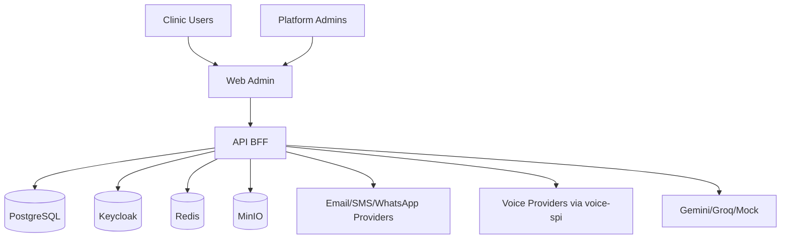
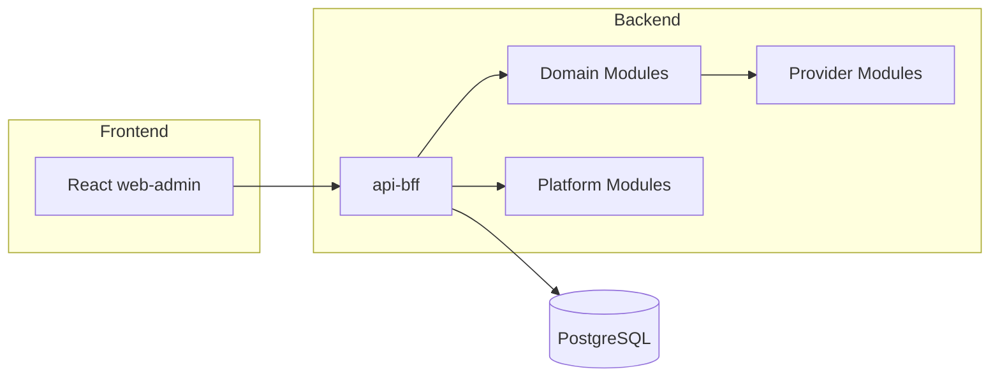
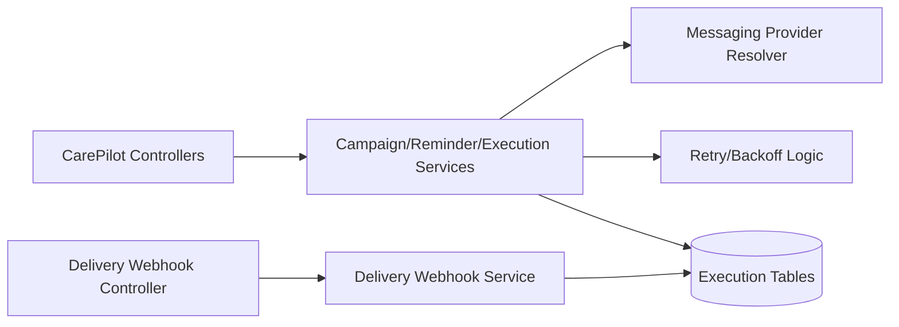
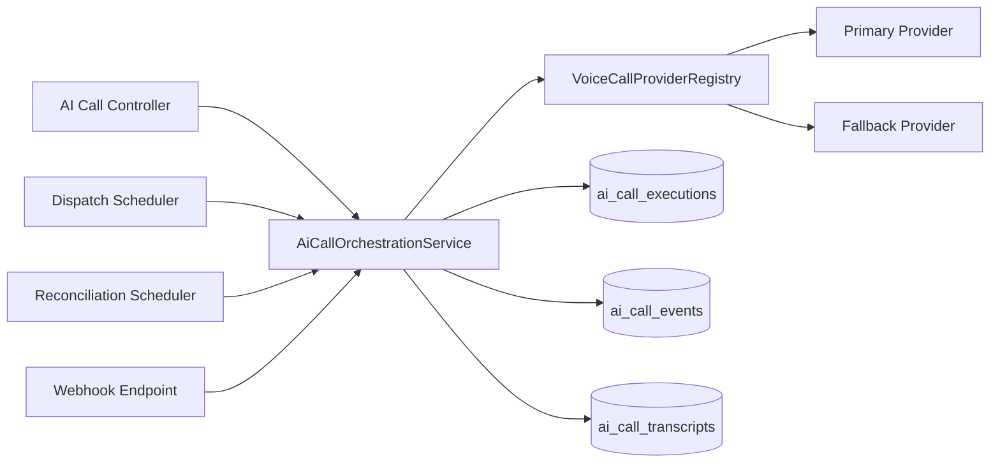
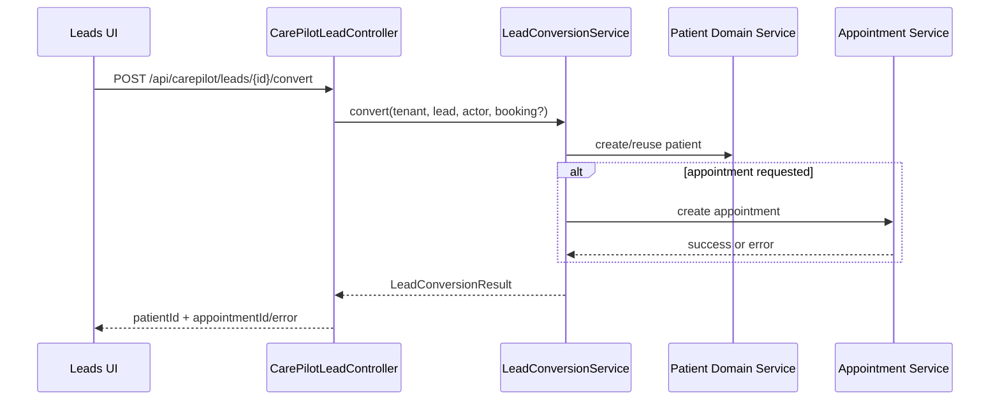
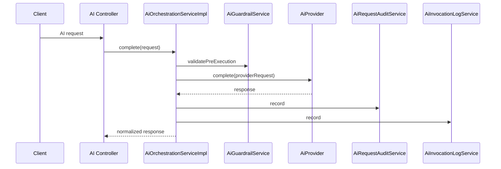
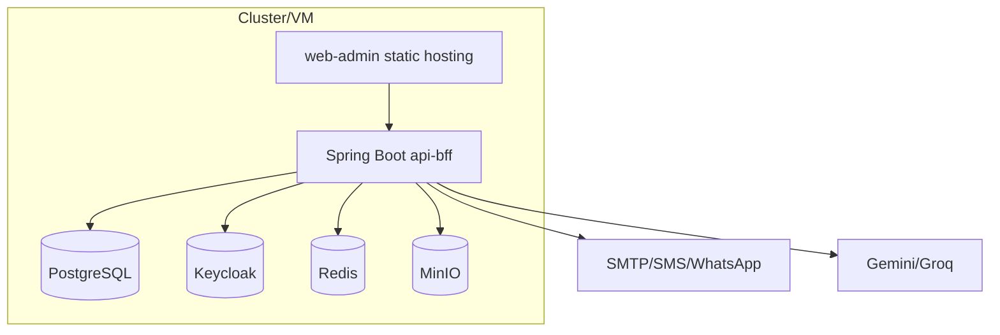

# Solution Architecture

## C4 - Context

## C4 - Container

## Component View - CarePilot

## Component View - AI Calls

## Sequence - Lead Conversion with Optional Appointment

## Sequence - AI Invocation Logging

## Deployment Integration View

