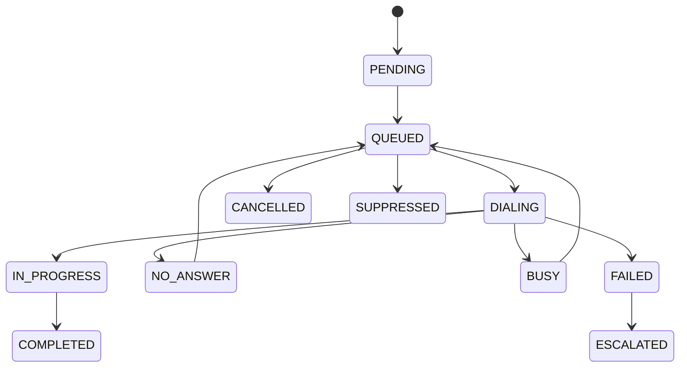
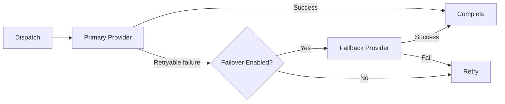

# AI Calls Flows

## Execution Queue Lifecycle

```mermaid
stateDiagram-v2
  [*] --> PENDING
  PENDING --> QUEUED
  QUEUED --> DIALING
  DIALING --> IN_PROGRESS
  IN_PROGRESS --> COMPLETED
  DIALING --> NO_ANSWER
  DIALING --> BUSY
  DIALING --> FAILED
  NO_ANSWER --> QUEUED
  BUSY --> QUEUED
  FAILED --> ESCALATED
  QUEUED --> CANCELLED
  QUEUED --> SUPPRESSED
```

## Provider Failover

```mermaid
flowchart LR
  Dispatch --> Primary[Primary Provider]
  Primary -->|Success| Complete
  Primary -->|Retryable failure| CheckFailover{Failover Enabled?}
  CheckFailover -->|Yes| Fallback[Fallback Provider]
  CheckFailover -->|No| Retry
  Fallback -->|Success| Complete
  Fallback -->|Fail| Retry
```
