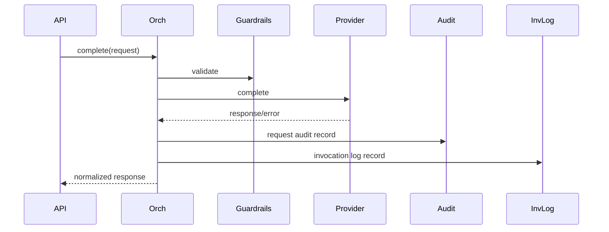

# AI Orchestration Lifecycle

```mermaid
sequenceDiagram
  participant API
  participant Orch
  participant Guardrails
  participant Provider
  participant Audit
  participant InvLog

  API->>Orch: complete(request)
  Orch->>Guardrails: validate
  Orch->>Provider: complete
  Provider-->>Orch: response/error
  Orch->>Audit: request audit record
  Orch->>InvLog: invocation log record
  Orch-->>API: normalized response
```
