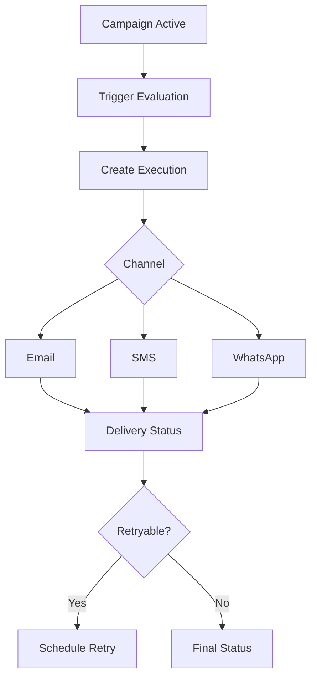
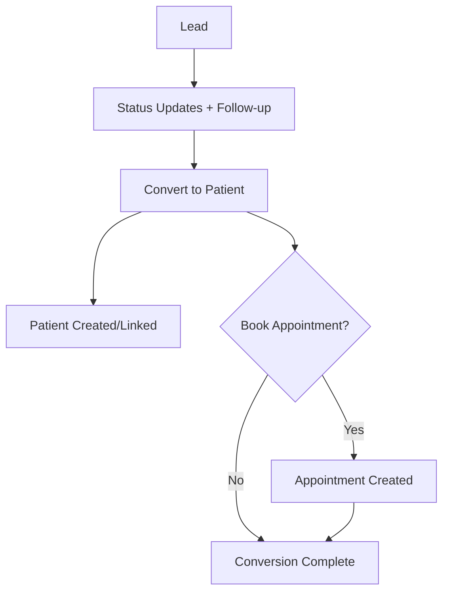

# CarePilot Flows

## Campaign and Reminder Flow

```mermaid
flowchart TD
  Campaign[Campaign Active] --> Trigger[Trigger Evaluation]
  Trigger --> Exec[Create Execution]
  Exec --> Channel{Channel}
  Channel --> Email
  Channel --> SMS
  Channel --> WhatsApp
  Email --> Status[Delivery Status]
  SMS --> Status
  WhatsApp --> Status
  Status --> Retry{Retryable?}
  Retry -->|Yes| Backoff[Schedule Retry]
  Retry -->|No| Final[Final Status]
```

## Lead Conversion Flow

```mermaid
flowchart TD
  Lead[Lead] --> Qualify[Status Updates + Follow-up]
  Qualify --> Convert[Convert to Patient]
  Convert --> Patient[Patient Created/Linked]
  Convert --> Appt{Book Appointment?}
  Appt -->|Yes| Appointment[Appointment Created]
  Appt -->|No| Done[Conversion Complete]
  Appointment --> Done
```
