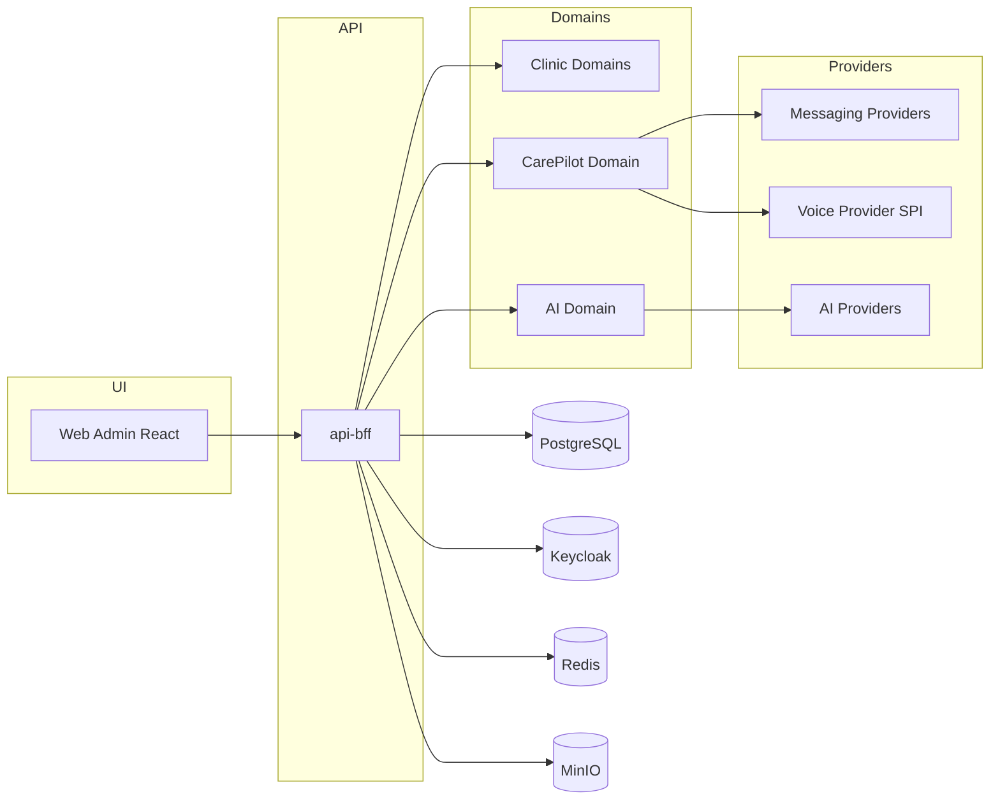

# High-Level Architecture Diagram

```mermaid
flowchart LR
  subgraph UI
    A[Web Admin React]
  end
  subgraph API
    B[api-bff]
  end
  subgraph Domains
    C1[Clinic Domains]
    C2[CarePilot Domain]
    C3[AI Domain]
  end
  subgraph Providers
    D1[Messaging Providers]
    D2[Voice Provider SPI]
    D3[AI Providers]
  end
  E[(PostgreSQL)]
  F[(Keycloak)]
  G[(Redis)]
  H[(MinIO)]

  A --> B
  B --> C1
  B --> C2
  B --> C3
  C2 --> D1
  C2 --> D2
  C3 --> D3
  B --> E
  B --> F
  B --> G
  B --> H
```
