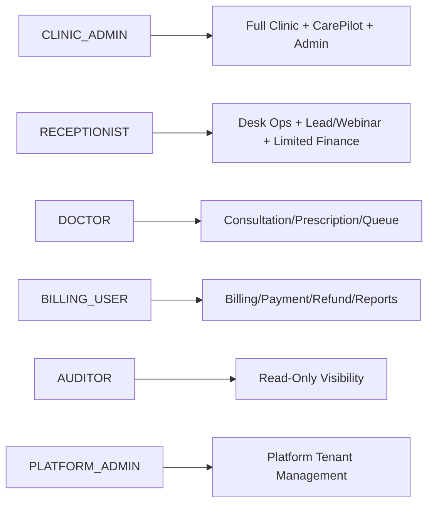
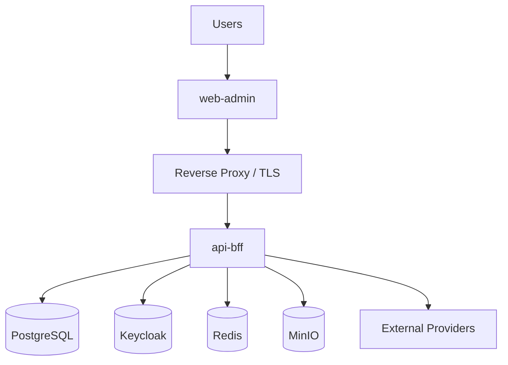

# RBAC and Deployment Topology

## RBAC Overview

```mermaid
flowchart LR
  CLINIC_ADMIN --> FullClinic[Full Clinic + CarePilot + Admin]
  RECEPTIONIST --> DeskOps[Desk Ops + Lead/Webinar + Limited Finance]
  DOCTOR --> ClinicalOps[Consultation/Prescription/Queue]
  BILLING_USER --> FinanceOps[Billing/Payment/Refund/Reports]
  AUDITOR --> ReadOnly[Read-Only Visibility]
  PLATFORM_ADMIN --> PlatformOps[Platform Tenant Management]
```

## Deployment Topology

```mermaid
flowchart TB
  LB[Reverse Proxy / TLS] --> API[api-bff]
  API --> PG[(PostgreSQL)]
  API --> KC[(Keycloak)]
  API --> RD[(Redis)]
  API --> MN[(MinIO)]
  API --> Ext[External Providers]
  Users --> Web[web-admin]
  Web --> LB
```
