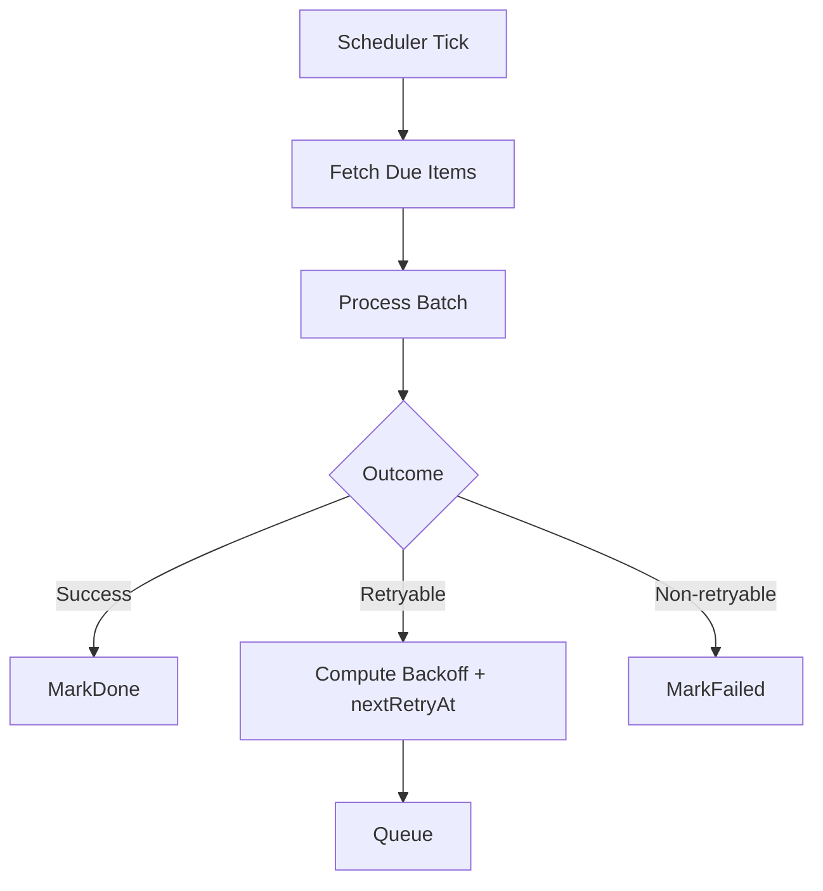

# Scheduler and Retry Lifecycle

```mermaid
flowchart TD
  Tick[Scheduler Tick] --> Fetch[Fetch Due Items]
  Fetch --> Process[Process Batch]
  Process --> Outcome{Outcome}
  Outcome -->|Success| MarkDone
  Outcome -->|Retryable| NextRetry[Compute Backoff + nextRetryAt]
  Outcome -->|Non-retryable| MarkFailed
  NextRetry --> Queue
```
