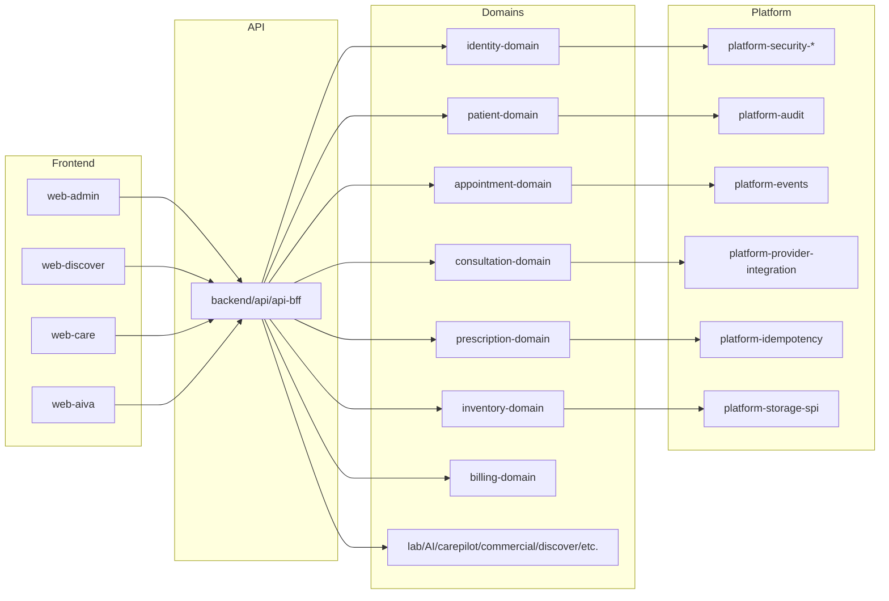
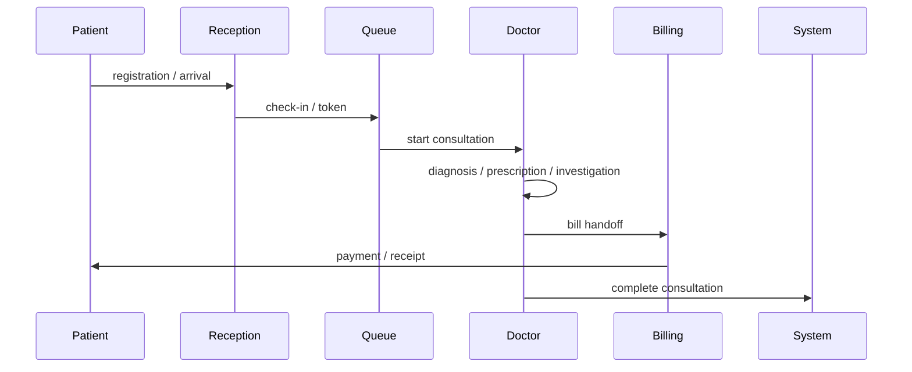
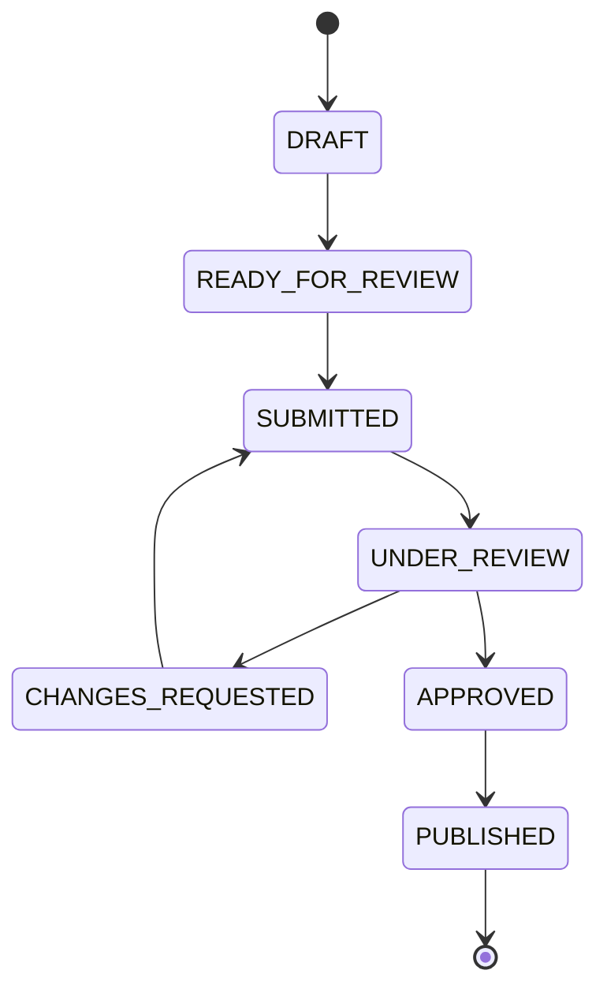

# Jeevanam Healthcare Functional Specification

Status: reverse-engineered from the current repository implementation
Basis: current routes/controllers/APIs, domain services, persistence schema, frontend pages, and existing automated tests

## 1. Document Purpose

This document is the functional baseline for the current Jeevanam Healthcare Platform repository. It describes the product as it actually exists in code today so that UAT, release validation, regression testing, support, and future change-impact analysis can use a single implementation-backed reference.

This document intentionally favors implemented behavior over old planning material. If a README, prior plan, or dashboard statement differs from the code, the code wins and the discrepancy is recorded rather than hidden.

## 2. Product Scope

Jeevanam is implemented as a multi-application healthcare platform with four product surfaces and one shared backend:

| Business product | Primary implementation surfaces | Purpose |
|---|---|---|
| Jeevanam Healthcare | `web-admin` | Operational clinical/admin console for clinics and hospitals |
| Jeevanam Discover | `web-discover` + public catalog APIs | Public discovery, directory, provider acquisition, and provider publication workflows |
| Jeevanam Connect | `web-discover` provider workspace + `api-bff` Discover provider APIs + Platform Admin review console | Provider-facing participation, profile management, review/publication lifecycle, and provider/public connection operations |
| Jeevanam Care | `web-care` | Patient journey / portal for appointments, prescriptions, reports, bills, and care handoff |
| Jeevanam AIVA | `web-aiva` + AI domain/providers | Standalone AI product shell and AI-assisted clinical/operational workflows |

The implementation is not a single monolith in the UX sense. It is a product family with shared backend foundations:

- `backend/api/api-bff` is the inbound adapter/orchestration layer
- `backend/domains/*` own business concepts and persistence
- `backend/platform/*` owns platform-wide foundations such as security, audit, events, storage, and runtime support
- `backend/providers/*` contains provider integrations

## 3. Product Architecture Overview

### 3.1 High-level topology

### 3.2 Shared implementation principles

- Authentication and authorization are enforced in the backend and mirrored in the frontend shell.
- Tenant context is explicit for tenant-operational modules.
- Platform mode is explicit for platform-wide admin workspaces.
- Provider publication is versioned and immutable once submitted/reviewed/published.
- Public Discover endpoints read publication-approved projections only.
- Patient-facing Care reads its own patient-session state and public catalog handoffs.
- AI features are assistance surfaces, not autonomous finalizers.

## 4. Application Boundaries

### 4.1 Healthcare application (`web-admin`)

Primary responsibility:

- clinic/hospital operations
- patient registration and management
- appointment, queue, reception, consultation, billing, pharmacy, laboratory, notifications, reporting
- platform administration workspaces
- commercial / tenant / entitlement workspaces
- operational AI and Engage/CarePilot workspaces

Key routes:

- `/dashboard`
- `/patients`
- `/appointments`
- `/queue`
- `/consultations`
- `/prescriptions`
- `/billing`
- `/inventory`
- `/lab`
- `/notifications`
- `/platform/*`
- `/carepilot/*`

### 4.2 Discover / Connect application (`web-discover`)

Primary responsibility:

- public directory and search
- doctor / clinic / hospital detail pages
- provider login and provider workspace
- provider onboarding and public profile publication
- provider review preview and moderation-related provider views

Key routes:

- `/`
- `/discover/doctors`
- `/discover/clinics`
- `/discover/hospitals`
- `/discover/specialities`
- `/discover/services`
- `/provider/login`
- `/provider`
- `/provider/applications`
- `/provider/public-profiles/:profileReference/:section`
- `/provider/public-profiles/:profileReference/review`

### 4.3 Care application (`web-care`)

Primary responsibility:

- patient portal
- patient login and registration
- appointments, prescriptions, reports, bills, notifications, patient profile
- patient-care AI entry points

Key routes:

- `/`
- `/patient/login`
- `/patient/register`
- `/patient/dashboard`
- `/patient/appointments`
- `/patient/prescriptions`
- `/patient/lab`
- `/patient/bills`
- `/patient/notifications`
- `/patient/careai`
- `/patient/profile`

### 4.4 AIVA application (`web-aiva`)

Primary responsibility:

- separate product entry / marketing shell for AIVA
- runtime/demo/architecture/roadmap navigation

Key routes:

- `/`
- `/demo`
- `/agents`
- `/platform`
- `/industries`
- `/architecture`
- `/roadmap`
- `/analytics`

## 5. Personas and Roles

Role definitions are canonicalized in `backend/platform/platform-security-spi/src/main/java/com/deepthoughtnet/clinic/platform/security/Roles.java` and mapped to permissions in `RolePermissionMappings.java`.

### 5.1 Canonical role matrix

| Role group | Canonical roles in code | Purpose | Typical scope |
|---|---|---|---|
| Platform administration | `PLATFORM_ADMIN`, `ADMIN`, `PLATFORM_TENANT_SUPPORT` | Global operational review, tenant/platform/commercial/discovery workspaces | Platform mode; selected tenant where applicable |
| Tenant / clinic administration | `TENANT_ADMIN`, `CLINIC_ADMIN` | Tenant operation, users, settings, patient flow, operational supervision | Tenant-scoped |
| Discovery provider workflow | `SERVICE_AGENT`, `AGENT`, `AGENT_OPERATOR` | Provider onboarding / service desk / operational support flows | Provider / platform support depending on route |
| Provider / clinical users | `DOCTOR`, `RECEPTIONIST`, `BILLING_USER`, `AUDITOR`, `VIEWER` | Frontline operational roles in clinic/hospital workflows | Tenant-scoped |
| Pharmacy | `PHARMA`, `PHARMACY`, `PHARMACIST`, `PHARMACY_INVENTORY_MANAGER`, `PHARMACY_POS_USER` | Inventory, dispensing, POS, procurement, reconciliation | Tenant-scoped |
| Laboratory | `LAB_FRONT_DESK`, `LAB_TECHNICIAN`, `LAB_ASSISTANT`, `LAB_APPROVER` | Lab ordering, collection, result entry, verification, reporting | Tenant-scoped |
| Engage / CRM | `ENGAGE_MANAGER`, `ENGAGE_EXECUTIVE` | Campaigns, reminders, leads, webinars, ops console | Tenant-scoped |
| Clinic generation / reconciliation / decisioning | `CLINIC_REVIEWER`, `CLINIC_APPROVER`, `CLINIC_AUDITOR`, `CLINIC_VIEWER`, `CLINIC_GENERATION_CREATOR`, `CLINIC_GENERATION_APPROVER`, `CLINIC_GENERATION_MANAGER`, `CLINIC_GENERATION_VIEWER`, `RECONCILIATION_OPERATOR`, `RECONCILIATION_REVIEWER`, `RECONCILIATION_MANAGER`, `RECONCILIATION_VIEWER`, `DECISIONING_MANAGER`, `DECISIONING_VIEWER` | Controlled maker/checker and review tooling | Tenant-scoped or platform-support depending on permission set |
| Delivery / service / household | `DISPATCHER`, `DRIVER`, `PARENT` | Ancillary operational roles already modeled in security | Tenant-scoped where used |
| Viewer / audit | `CLINIC_AUDITOR`, `AUDITOR` | Read-only audit and oversight access | Tenant-scoped or platform-visible where granted |

### 5.2 Role behavior summary

- `PLATFORM_ADMIN` is the canonical role for platform mode and global platform workspaces.
- `TENANT_ADMIN` and `CLINIC_ADMIN` are tenant-operational roles.
- Most clinician and operational roles require a tenant context before routes render actual data.
- `AUDITOR` is read-heavy and commonly granted broad read permissions but remains bounded by tenant or platform route policy.
- Provider-facing Discover workflows are not exposed as Healthcare tenant routes.

### 5.3 Authorization enforcement

Backend authorization is enforced through:

- `@PreAuthorize(...)` annotations on controllers
- `permissionChecker` permission checks
- tenant context resolution via `RequestContextHolder.requireTenantId()`
- route guards in `web-admin`
- provider session and provider ownership checks in `web-discover`

## 6. Common Platform Principles

### 6.1 Authentication

- Healthcare uses authenticated application users and tenant context.
- Discover provider workflows use an opaque provider session and provider account identity.
- Care uses patient OTP / portal session flows.
- Public Discover routes remain anonymous where intended.
- AIVA has its own product shell and can point to runtime URLs.

### 6.2 Authorization / RBAC

- Role mappings are centralized in `platform-security-spi`.
- Permission strings are the canonical authorization unit in the backend.
- Frontend menus and route guards reflect backend permissions but do not replace them.

### 6.3 Tenant isolation

- Tenant-scoped routes require a tenant context for actual operational data.
- Platform mode is a distinct state for platform admins and must not be treated as an error.
- Provider/public profile moderation and commercial/platform workspaces may intentionally work without a selected tenant when the route is platform-scoped.

### 6.4 Platform mode vs tenant mode

- Platform mode: no tenant selected, global platform administration scope.
- Tenant mode: clinic/tenant selected, operational clinic scope.
- The code uses this distinction in `web-admin` route gates and in platform workspaces.

### 6.5 Audit, idempotency, and state transitions

- Audit exists for many operational and moderation workflows.
- Several critical workflows are maker/checker or submit/review/approve/publish state machines.
- Publication and approval are explicitly separate for Discover provider profiles.

### 6.6 Search, filter, pagination, and status conventions

- Lists use page/size conventions in public and admin UIs.
- Public review queues, provider applications, and platform connections are URL/filter driven.
- Status labels are humanized in the UI but backed by canonical enums in the backend.

### 6.7 Date / time / timezone

- Tenant-aware views format timestamps in the selected clinic timezone where relevant.
- Discover provider review and public profile pages present persisted timestamps and status histories.
- Patient and care flows preserve patient-session timing and date display utilities.

## 7. Functional Modules

### 7.1 Platform foundation

#### What it does

- tenant management
- commercial catalog and subscriptions
- effective entitlements
- platform admin navigation and access
- audit and operational support
- health / runtime / support workspaces

#### Implementation references

- `web-admin/src/app/App.tsx`
- `web-admin/src/layout/nav.ts`
- `web-admin/src/modules/moduleRegistry.ts`
- `backend/api/api-bff/src/main/java/com/deepthoughtnet/clinic/api/platform/*`
- `backend/api/api-bff/src/main/java/com/deepthoughtnet/clinic/api/admin/*`
- `backend/platform/platform-security-spi/*`

### 7.2 Patient management

#### What it does

- patient create, search, edit, detail, documents, identity handling
- patient header and longitudinal records where surfaced

#### Implementation references

- `backend/api/api-bff/src/main/java/com/deepthoughtnet/clinic/api/patient/PatientController.java`
- `web-admin/src/pages/patients/*`
- `backend/domains/patient-domain/*`
- tests under `backend/api/api-bff/src/test/java/com/deepthoughtnet/clinic/api/patient/*`

### 7.3 Appointments, reception, queue, OPD

#### What it does

- appointment create/search/reschedule/cancel
- reception handoff
- queue ordering and day board
- doctor availability and consultation handoff

#### Implementation references

- `backend/api/api-bff/src/main/java/com/deepthoughtnet/clinic/api/appointment/AppointmentController.java`
- `backend/api/api-bff/src/main/java/com/deepthoughtnet/clinic/api/appointment/AppointmentWaitlistController.java`
- `backend/api/api-bff/src/main/java/com/deepthoughtnet/clinic/api/appointment/DoctorAvailabilityController.java`
- `backend/api/api-bff/src/main/java/com/deepthoughtnet/clinic/api/consultation/ConsultationController.java`
- `web-admin/src/pages/appointments/*`
- `web-admin/src/pages/consultations/*`

### 7.4 Doctor workspace / consultation

#### What it does

- consultation create/update/complete/cancel
- SOAP/clinical note capture
- AI summary support
- prescription and investigation handoff

#### Implementation references

- `backend/api/api-bff/src/main/java/com/deepthoughtnet/clinic/api/consultation/ConsultationController.java`
- `backend/api/api-bff/src/main/java/com/deepthoughtnet/clinic/api/consultation/service/*`
- `web-admin/src/pages/consultations/ConsultationWorkspacePage.tsx`

### 7.5 Clinical AI / AIVA

#### What it does

- consultation-aware clinical reasoning
- optional AI assistance with deterministic fallbacks
- persisted reasoning / AI outputs / prompt context

#### Implementation references

- `backend/api/api-bff/src/main/java/com/deepthoughtnet/clinic/api/ai/AiDoctorCopilotController.java`
- `backend/api/api-bff/src/main/java/com/deepthoughtnet/clinic/api/ai/reasoning/ClinicalReasoningController.java`
- `backend/api/api-bff/src/main/java/com/deepthoughtnet/clinic/api/ai/clinicalcontext/ClinicalContextService.java`
- `backend/api/api-bff/src/main/java/com/deepthoughtnet/clinic/api/medicationsafety/MedicationSafetyEngine.java`
- tests under `backend/api/api-bff/src/test/java/com/deepthoughtnet/clinic/api/ai/*` and `.../medicationsafety/*`

### 7.6 Prescription and medication safety

#### What it does

- prescription draft, versioning, finalize, print/send
- medication safety checks, blocking logic, acknowledgement/override

#### Implementation references

- `backend/api/api-bff/src/main/java/com/deepthoughtnet/clinic/api/prescription/PrescriptionController.java`
- `backend/api/api-bff/src/main/java/com/deepthoughtnet/clinic/api/medicationsafety/MedicationSafetyController.java`
- `backend/api/api-bff/src/main/java/com/deepthoughtnet/clinic/api/medicationsafety/MedicationSafetyReviewService.java`
- tests under `backend/api/api-bff/src/test/java/com/deepthoughtnet/clinic/api/prescription/*` and `.../medicationsafety/*`

### 7.7 Investigations, laboratory, and reporting

#### What it does

- lab catalog configuration
- lab order create/read/collect/result/verify/report
- attachments and report publication

#### Implementation references

- `backend/api/api-bff/src/main/java/com/deepthoughtnet/clinic/api/lab/LabController.java`
- `backend/api/api-bff/src/main/java/com/deepthoughtnet/clinic/api/reports/ReportsController.java`
- `web-admin/src/pages/lab/*`
- tests under `backend/api/api-bff/src/test/java/com/deepthoughtnet/clinic/api/lab/*`

### 7.8 Pharmacy / inventory

#### What it does

- supplier, purchase order, supplier invoice, GRN, inventory, POS, dispensing, reconciliation

#### Implementation references

- `backend/api/api-bff/src/main/java/com/deepthoughtnet/clinic/api/pharmacy/*`
- `backend/api/api-bff/src/main/java/com/deepthoughtnet/clinic/api/inventory/*`
- `web-admin/src/pages/pharmacy/*`
- tests under `backend/api/api-bff/src/test/java/com/deepthoughtnet/clinic/api/pharmacy/*` and `.../inventory/*`

### 7.9 Billing / finance

#### What it does

- bills, receipts, payments, cash counter, refunds

#### Implementation references

- `backend/api/api-bff/src/main/java/com/deepthoughtnet/clinic/api/billing/*`
- `web-admin/src/pages/billing/*`
- `web-admin/src/pages/finance/*`

### 7.10 Engage / CarePilot CRM

#### What it does

- campaigns, audiences, approvals, activation, execution, delivery attempts, reminders, leads, webinars, ops console, AI operations

#### Implementation references

- `backend/api/api-bff/src/main/java/com/deepthoughtnet/clinic/api/carepilot/*`
- `web-admin/src/products/carepilot/*`

### 7.11 Notifications

#### What it does

- user notifications
- notification operations
- notification center / inbox surfaces

#### Implementation references

- `backend/api/api-bff/src/main/java/com/deepthoughtnet/clinic/api/notifications/*`
- `backend/api/api-bff/src/main/java/com/deepthoughtnet/clinic/api/notificationcenter/*`
- `web-admin/src/pages/notifications/*`
- `web-admin/src/pages/notification-center/*`

### 7.12 Discover public site

#### What it does

- public search, listing, directory, and profile pages for doctors, clinics, hospitals, and specialities
- public landing / homepage / pricing / healthcare entry

#### Implementation references

- `web-discover/src/routes.ts`
- `backend/api/api-bff/src/main/java/com/deepthoughtnet/clinic/api/publicsite/*`
- `backend/api/api-bff/src/main/java/com/deepthoughtnet/clinic/api/discover/ProviderLandingPageController.java`
- `backend/api/api-bff/src/main/java/com/deepthoughtnet/clinic/api/publicsite/PublicCatalogController.java`
- `web-discover/src/pages/discovery/PublicDiscoveryPages.tsx`
- `web-discover/src/components/landing/*`

### 7.13 Jeevanam Connect / provider workspace

#### What it does

- provider registration / login / onboarding
- provider workspace dashboard
- provider profile draft editing and preview
- provider public profile moderation and publication
- ownership, memberships, hospital-doctor associations

#### Implementation references

- `backend/api/api-bff/src/main/java/com/deepthoughtnet/clinic/api/discover/ProviderOnboardingController.java`
- `backend/api/api-bff/src/main/java/com/deepthoughtnet/clinic/api/discover/provider/auth/ProviderWorkspaceController.java`
- `backend/api/api-bff/src/main/java/com/deepthoughtnet/clinic/api/discover/provider/publicprofile/ProviderPublicProfileDraftController.java`
- `backend/api/api-bff/src/main/java/com/deepthoughtnet/clinic/api/discover/provider/publicprofile/ProviderPublicProfileModerationController.java`
- `backend/api/api-bff/src/main/java/com/deepthoughtnet/clinic/api/platform/providerconnections/*`
- `backend/domains/discover-domain/src/main/java/com/deepthoughtnet/clinic/discover/*`
- `web-discover/src/pages/provider/*`
- `web-admin/src/pages/platform/ProviderConnectionsPage.tsx`

### 7.14 Care / patient portal

#### What it does

- patient login / registration
- appointments, bills, prescriptions, lab reports, notifications, profile
- Discover handoff for search and booking

#### Implementation references

- `web-care/src/App.tsx`
- `web-care/src/pages/patient/*`
- `backend/api/api-bff/src/main/java/com/deepthoughtnet/clinic/api/patientportal/*`

### 7.15 Platform Admin / commercial

#### What it does

- tenants, product implementation dashboard, provider applications, provider connections, commercial platform, plans, entitlements, runtime diff, help CMS, platform ops

#### Implementation references

- `web-admin/src/pages/platform/*`
- `backend/api/api-bff/src/main/java/com/deepthoughtnet/clinic/api/platform/*`
- `backend/api/api-bff/src/main/java/com/deepthoughtnet/clinic/api/platform/discover/*`
- `backend/api/api-bff/src/main/java/com/deepthoughtnet/clinic/api/platform/providerconnections/*`

## 8. End-to-End Workflows

### E2E-01 Patient registration -> appointment -> reception -> queue -> consultation -> prescription -> billing -> completion

Actor: patient, receptionist, doctor, billing user

State flow:

Persistence: patient, appointment, queue, consultation, prescription, bill, receipt, audit.

Negative paths: missing tenant, wrong role, duplicate patient, invalid consultation completion, payment bypass denied, refresh preserves persisted state.

### E2E-02 Consultation -> investigation -> lab order -> collection -> result -> verify -> report

Actor: doctor, front desk, technician, approver, patient

Persistence: lab order, samples, results, verification, report publication, audit.

Negative paths: unauthorized role, invalid result entry, report generation blocked before verification.

### E2E-03 Supplier -> PO -> supplier invoice -> GRN -> inventory -> POS -> reconciliation

Actor: pharmacist, inventory manager, cashier, reconciler

Persistence: procurement records, inventory movements, reconciliation events, audit.

Negative paths: duplicate PO/invoice, invalid GRN, insufficient stock, unauthorized POS/reconcile.

### E2E-04 Patient -> Discover -> doctor -> appointment -> Care

Actor: public user/patient

Flow: public search -> provider detail -> booking intent -> care handoff/login -> patient portal.

Negative paths: wrong slug, unavailable booking capability, direct care route without session.

### E2E-05 Provider registration -> verification -> public profile -> submit -> Platform review -> approve -> publish -> Discover

Actor: provider, Platform Admin

Key rule: approval and publication are separate actions; the immutable submitted snapshot is the source of publication promotion.

Persistence: provider account/session, ownership, membership, draft sections, draft media, submitted review snapshot, findings, publication snapshot, public projection.

### E2E-06 Hospital -> associate doctors -> preview -> submit -> approve -> publish

Actor: hospital provider, Platform Admin

Key rule: hospital-doctor associations are draft/public isolated. The provider preview reads draft associations; the public hospital reads published associations only.

Negative paths: adding/removing doctors in draft must not leak to public; publication must promote the approved association set atomically.

### E2E-07 Campaign -> submit -> approve -> activate -> execute -> delivery -> reminder/follow-up

Actor: engage manager/executive, platform/tenant reviewer

Persistence: campaigns, approval history, execution records, delivery events/attempts, reminder queue, audit.

Negative paths: wrong tenant, invalid status transition, duplicate approval, missing audience/template.

### E2E-08 Consultation -> Clinical Reasoning -> prescription -> Medication Safety -> finalize

Actor: doctor

Key rule: AI assistance and safety review are clinician-controlled. Medication Safety can block finalization until acknowledgement/override is recorded.

Persistence: reasoning records, medication safety review, acknowledgment, prescription version/finalization, audit.

## 9. Integration Behaviour

### 9.1 Public Discover and provider publication

- Public catalog APIs use publication-approved projections only.
- Provider draft updates do not affect public read endpoints until approval/publication.
- Media is resolved from the published profile projection or the immutable submitted preview, depending on context.

### 9.2 Platform Admin review and provider workspace

- Platform Admin review queues operate in platform mode without tenant selection.
- Provider workspace shows active applications, published profiles, and attention items separately.
- `Provider Connections` includes public profiles, public profile reviews, platform entities, suggestions, links, ownerships, conflicts, and audit tabs.

### 9.3 Tenant and platform scope

- Tenant-operational workspaces require tenant context.
- Platform workspaces are global by default.
- Selecting a tenant narrows some views where intended, but tenant selection is not a prerequisite for global platform moderation workspaces.

### 9.4 Notifications and background workflows

- Notifications are event-driven or operationally queued depending on module.
- CarePilot and AI Ops are implemented as operational workspaces, not as background-only placeholders.

### 9.5 Files and documents

- Uploaded documents are persisted through storage abstractions, not embedded in rows as bytes.
- Document/media endpoints stream content through API adapters.

## 10. Non-functional Functional Constraints

- Patient safety critical flows must remain deterministic where business rules exist.
- AI suggestions must not auto-finalize clinician actions.
- Public profile publication must remain atomic and versioned.
- Provider preview must not alter the published public snapshot.
- Platform mode must remain usable without tenant selection.
- Route refresh/back-forward must preserve URL-driven state where the implementation relies on it.
- Search/filter/pagination conventions are URL-backed in the major platform workspaces.

## 11. Known Exclusions / Deliberate Limitations

These are implemented boundaries, not missing features:

- Hospital booking semantics remain contact-only / call-to-book at hospital level.
- Doctor-specific online booking remains doctor-specific.
- Discover public pages are read-only and do not expose unpublished draft state.
- Provider review and approval are separate from publication.
- AIVA is assistance-oriented; no autonomous clinical decision making is claimed.
- Patient portal capabilities are intentionally narrower than the clinic admin console.

## 12. Glossary

- **Platform mode**: Platform admin scope with no tenant selected.
- **Tenant mode**: Operational clinic/tenant scope.
- **Draft**: Mutable provider/public-profile working copy.
- **Submitted snapshot**: Immutable version sent for review.
- **Under review**: A submitted snapshot is actively being reviewed.
- **Approved**: The review has passed moderation.
- **Published**: The approved snapshot has been promoted to the live public projection.
- **Call to book**: Hospital-level contact-only booking semantic.
- **Provider workspace**: The provider-facing Discover/Connect area in `web-discover`.
- **Public projection**: The patient-facing live profile data exposed by public APIs.
- **Maker/checker**: Controlled approval flow used in campaigns, provider review, and operational workflows.

## 13. Implementation / Documentation Discrepancies

- `PRODUCT_READINESS.md` already reflects the post-feature-complete posture, but it remains a supplementary evidence document. Use the current code and test suite as the primary source of truth.
- Some UX copy in the repository still uses legacy labels such as “CarePilot” internally even when the product-facing label is “Engage.”
- Provider/public lifecycle semantics are spread across `discover-domain`, `api-bff`, and `web-discover`; the canonical behavior is the composite of those layers, not any one file in isolation.

