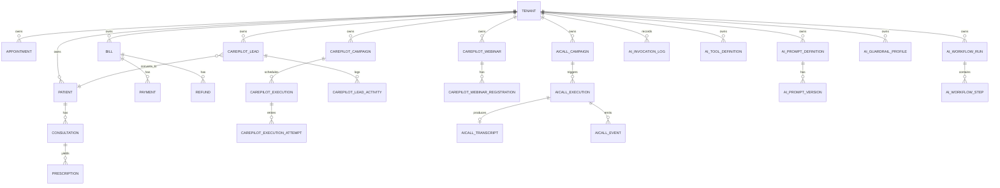

# Database Design

Schema is migration-driven via Flyway scripts `V001` to `V042`.

## Tenant Scoping Strategy
- Most operational tables include `tenant_id`.
- Service layer filters on tenant context (`RequestContextHolder.requireTenantId()`).
- Platform-level tables may be global or cross-tenant with explicit admin APIs.

## Major Domain Table Groups

## Core Clinic
- Patients, appointments, consultations, prescriptions, prescription versions/history.
- Doctor availability, unavailability, queue, waitlist foundations.
- Vaccines and patient vaccinations.

## Finance
- Bills, bill items, payments, refunds, receipts.
- Billing maturity and status transitions introduced in `V029`.

## Pharmacy/Inventory
- Medicines, stock batches/levels, inventory transactions, dispensing artifacts (`V028`).

## Notifications and Audit Foundations
- Notification history/outbox (`V009`, `V013`).
- Audit and idempotency foundations (`V013`).

## CarePilot
- Campaign definitions/executions/attempts/delivery tracking (`V030`, `V032`, `V034`).
- Leads and lead activities (`V035`, `V036`).
- Webinar and registrations (`V037`).
- Templates (`V038`).
- Tenant notification settings (`V039`).
- AI calls campaigns/executions/transcripts/events (`V040`, `V041`).

## AI Platform
- Prompt definitions/versions.
- Invocation logs.
- Tool definitions.
- Workflow runs/steps.
- Guardrail profiles.
- Added in `V042`.

## ER-style Overview

## Indexing Patterns
- Tenant + status/time indexes for queue/list APIs.
- Domain-specific query indexes for follow-up, next retry, execution status, and analytics scans.

## Data Evolution Strategy
- Additive migrations only.
- Existing migrations are immutable; changes are introduced through new versions.

