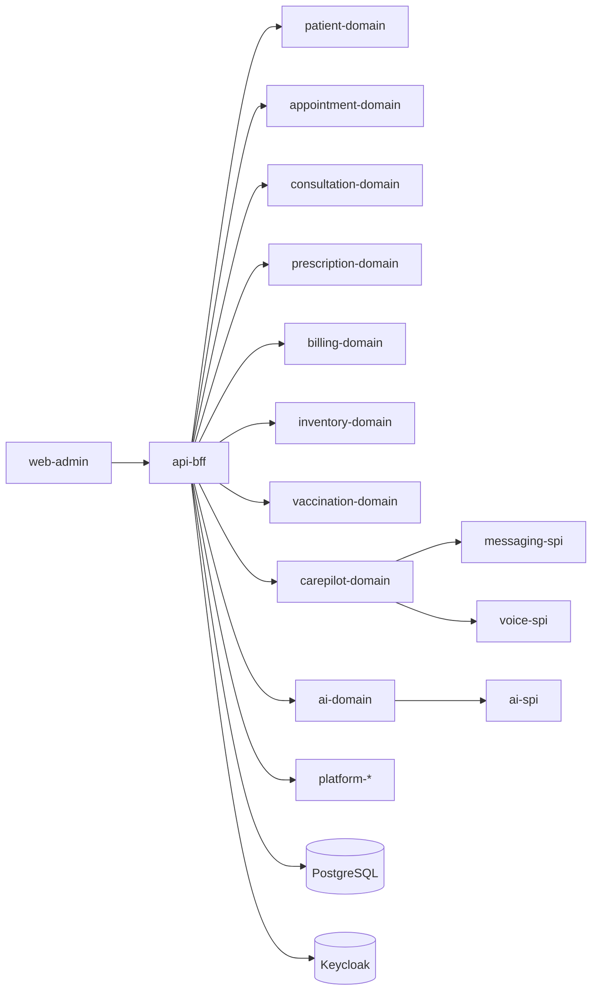

# Technical Design Document (TDD)

## 1. High-Level Architecture
- `api-bff` is the primary API boundary.
- Domain modules (`backend/domains/*`) contain business logic and persistence.
- Platform modules (`backend/platform/*`) provide shared primitives (security, context, audit, outbox, jobs).
- Provider modules (`backend/providers/*`) implement SPI adapters.
- `web-admin` is React + MUI + route-based product shell.

## 2. Backend Design
- Controllers in `backend/api/api-bff/src/main/java/com/deepthoughtnet/clinic/api/**`.
- DTO-first boundary with conversion to domain commands/records.
- Request tenant context accessed via `RequestContextHolder.requireTenantId()`.
- Migrations drive schema evolution (`V001..V042`).

## 3. Frontend Design
- Route map in `web-admin/src/app/App.tsx`.
- Role-aware navigation in `web-admin/src/layout/nav.ts`.
- API integration in `web-admin/src/api/clinicApi.ts`.
- Product areas: clinic operations, carepilot, admin, platform.

## 4. Tenant and RBAC Design
- Tenant ID from request context is mandatory for tenant-scoped operations.
- Role permissions resolved through platform security mappings.
- Controller methods use `@PreAuthorize` with role checks.
- Some platform-admin paths require tenant support role conjunction.

## 5. Provider SPI Architecture
- `MessageProvider` (`messaging-spi`) with email/sms/whatsapp providers.
- `NotificationProvider` (`notify-spi`) with email/logging providers.
- `VoiceCallProvider` (`voice-spi`) with mock implementation in carepilot domain.
- AI providers implement `AiProvider` in ai-domain adapters (Gemini, Groq, Mock).

## 6. AI Orchestration Platform Design
- Prompt registry: `ai_prompt_definitions`, `ai_prompt_versions`.
- Invocation logs: `ai_invocation_logs`.
- Usage aggregation service for cost/token/latency summaries.
- Guardrail profile + validation hook before provider execution.
- Tool/workflow logs as foundation tables for future agent runtime.

## 7. CarePilot Technical Design
- Campaign/reminder/execution core with retry/backoff.
- Delivery webhooks ingest provider statuses.
- Lead/webinar/AI-calls are separate subdomains within carepilot-domain.
- AI calls include queue, scheduler, reconciliation, webhook, event log, transcript.

## 8. Transaction Boundaries
- Mutations handled in domain services with transactional boundaries per operation.
- Scheduler-driven dispatch is batch-oriented with per-execution fault isolation.

## 9. Reliability and Failure Handling
- Retry policies in notifications/carepilot/ai-calls.
- Suppression/cancellation/reschedule actions for queued work.
- Provider readiness checks and no-op fallback provider for missing config in messaging.

## 10. Observability
- Metrics/health exposed via actuator.
- Execution/event histories in carepilot and ai tables.
- AI invocation logs include status, provider, model, tokens, cost estimate, latency.

## 11. Extensibility
- New providers can be added at SPI level without domain rewrite.
- New prompt versions and guardrail profiles are runtime-configurable.
- Workflow/tool registry tables enable future multi-step agent orchestration.

